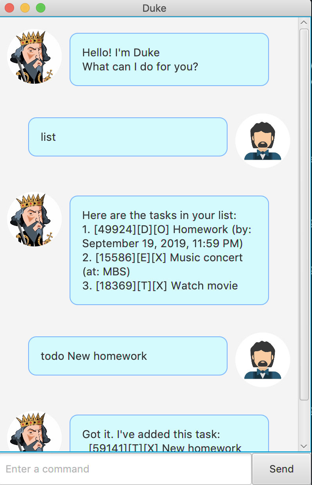

# Duke User Guide

Duke is a chatbot to help people manage their tasks easily. 
You can take note and update it via GUI that behaves that behaves like a
command line interaction.

## Requirements

- Java 11 or later

## Features 

### Interactive user interface

Duke chatbot uses a GUI that gives you interactive feedback for every command
that you write. It responds as if you are chatting with a real person that
always available to help you manage your tasks.

### Differentiates your tasks

There are several types of tasks that are supported by Duke chatbot to help
you classify different types of task that you have. Every task can also be 
uniquely identified with an 5-digit integer ID. 

### Sort your tasks

By default, the tasks will be sorted by creation time. However, you can also 
ask Duke to show your tasks based on last updated time.

### Find your tasks

You can ask Duke to find task that contain a certain keyword in your command.

### Detect duplicates

Duke chatbot will also prevent you from inserting duplicate tasks in case you
forget that you have added a certain task.

## Usage

### Add a new task

Add a new task into the list of tasks that are stored by Duke chatbot for you.

**Usage example:**
`todo [description]`  
`deadline [description] /by [byDescription]`  
`event [description] / by [atDescription]`

**Example of usage:**
- `todo watch movie`  
Adds a new todo task with description `watch movie`.

- `deadline homework /by 19/09/2019 23:59`  
Adds a new deadline task with description `homework`.
Time description will be automatically formatted to 
`September 19, 2019, 11:59 PM`.

- `event music concent /at MBS`  
Adds a new event task with description `music concert`.
Location description will be written as `MBS`.

***

### Marks task as done

Marks a particular task as done in the list of tasks.

**Usage example:**
`done [taskID]`

**Example of usage:**
- `done 49924`  
Mark task with id `49924` as done.

***

### Deletes a task in the list

Removes a certain task from the list of tasks.

**Usage example:**
`delete [taskID]`

**Example of usage:**
- `delete 49924`
Removes task with id `49924`.

***

### Find tasks in the list

Finds all the tasks that contain a certain keyword in its description.

**Usage example:**
`find [keyword]`

**Example of usage:**
- `find homework`
Find all tasks that contain keyword `homework` in its description.

***

### Find tasks in the list

Lists all the tasks that are currently stored by the Duke chat bot.

**Usage example:**
- `list`
- `list /orderby [sort type]`

**Example of usage:**
- `list`
By default, this will lists all tasks based on their creation time.

- `list /orderby createdAt`
List all tasks based on their creation time.

- `list /orderby updatedAt`
List all tasks based on their last updated time.
